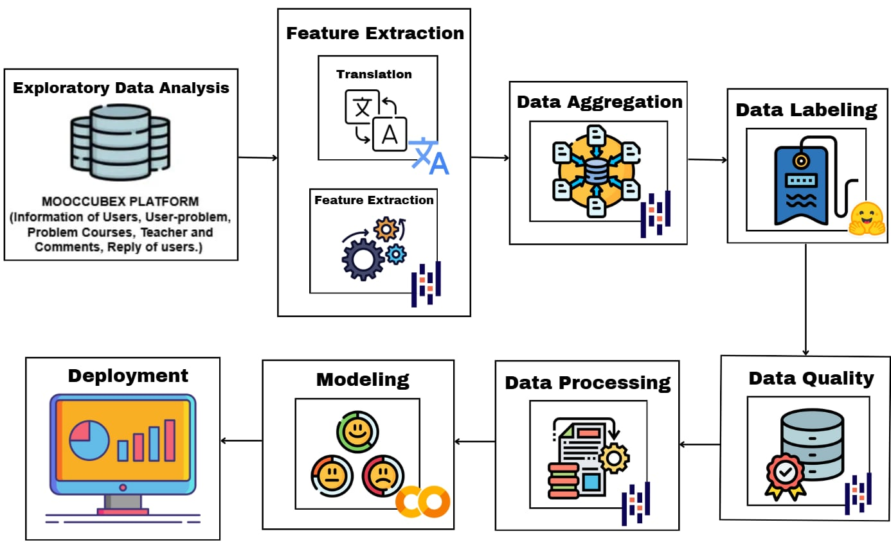
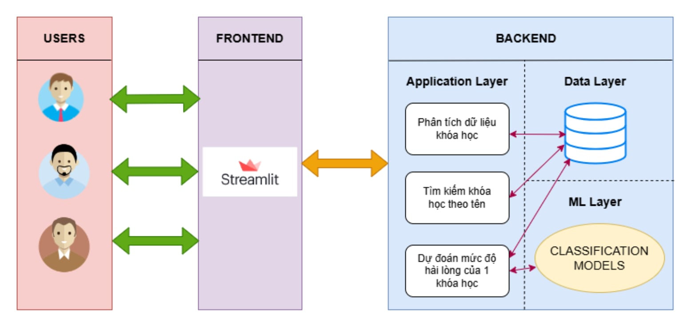
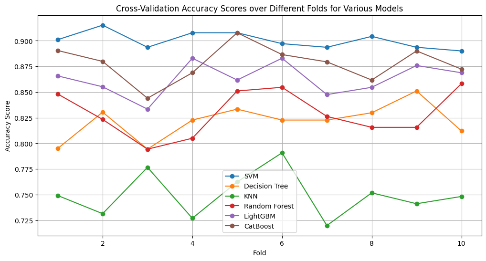

# Đồ án môn DS317 - Khai phá dữ liệu trong doanh nghiệp
Danh sách các thành viên:
| Họ và tên       | MSSV          |  
|-------------    |---------------|
| Hồ Trọng Duy Quang     | 22521200   |
| Nguyễn Hồng Phát     | 22521072   |
| Nguyễn Trần Phúc     | 22521135   |
| Lê Cảnh Nhật     | 22521016   |
| Nguyễn Gia Bảo     | 22520108   |

Giáo viên hướng dẫn: Ths.Nguyễn Thị Anh Thư

# Định nghĩa bài toán:
Trong bối cảnh giáo dục trực tuyến đang phát triển nhanh chóng, bài toán đặt ra là dự đoán mức độ hài lòng của học viên đối với các khóa học trực tuyến (MOOC). Việc dự đoán này sẽ giúp xác định trước mức độ hài lòng của học viên dựa trên các yếu tố liên quan đến khóa học và trải nghiệm của người học, từ đó hỗ trợ cải thiện chất lượng khóa học và nâng cao trải nghiệm của học viên.

# Framework của đồ án:


# Kiến trúc hệ thống:


# Framework triển khai trên cloud:


# Evaluation models:


# Các bước triển khai web ở local:
Lần lượt chạy các câu lệnh sau:
``` 
git clone https://github.com/Wan1302/DS317-project.git 
```
``` 
cd DS317-project/web
```
```
pip install -r requirements.txt
```
```
streamlit run app.py
```

# [Các bước triển khai trên cloud:](https://github.com/Wan1302/DS317-project/blob/main/docs/cloud_deployment_guide.md) 

# [Hướng dẫn sử dụng web:](https://github.com/Wan1302/DS317-project/blob/main/docs/demo_instructions.md)

