# Các bước triển khai chính trên điện toán đám mây AWS. Do hạn chế về tài nguyên nên nhóm chỉ sử dụng ba services chính là `Amazon SageMaker AI` để chạy thử model, `EC2` để deploy web và `S3` để lưu trữ data.


## I. Các bước triển khai trên `Amazon SageMaker AI`:
### B1: Đăng nhập tài khoản trên AWS và tìm chọn service `Amazon SageMaker AI`.
### B2: Tìm và chọn Notebooks ở phía bên tay trái.

### B3: Nhấn chọn Create notebook instance.

### B4: Sau khi đặt tên cho notebook ở phần `Notebook instance settings`, ở phần `Permissions and encryption` chọn Create a new role. Sau đó nhấn Create role.
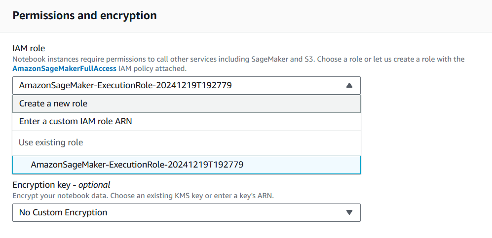

### B5: Tạo một Key và Value cho notebook (ví dụ như Key: app, Value: test) và nhấn Create notebook instance.
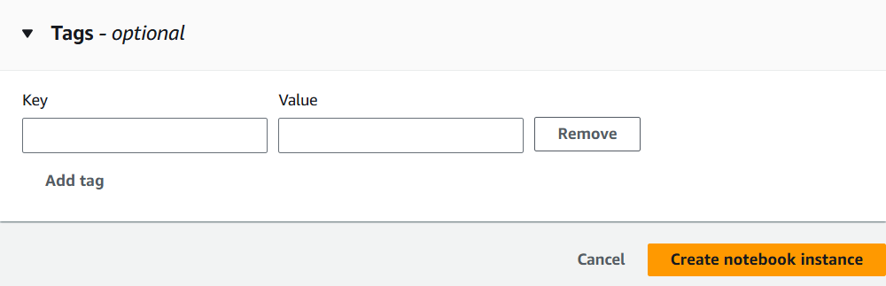
### B6: Sau khi tạo xong sẽ thấy notebook instance đã tạo và nhấn vào Open Jupyter. Sau đó sẽ được chuyển tới giao diện của Jupyter notebook, upload những file cần thiết như model, notebook, dataset và thực hiện các thao tác trên notebook như bình thường.


## II. Các bước triển khai trên `EC2`:
### B1: Đăng nhập tài khoản trên AWS và tìm chọn service `EC2`.
### B2: Chọn Launch instance.
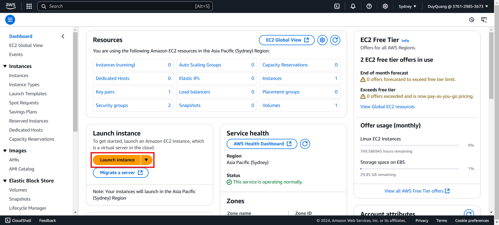
### B3: Thực hiện theo các bước sau:
* Ở phần Name and tags điền tên web server, phần Application and OS Images chọn Ubuntu.

* Phần Instance type chọn t2.micro, phần Key pair nhấn chọn `Create new key pair`.

* Sau đó tạo tên key pair mong muốn. 

* Cuối cùng ở phần Network settings tick chọn tất cả Allow và phần Configure storge chọn loại gp2. Sau đó nhấn Launch instance để tạo instance.
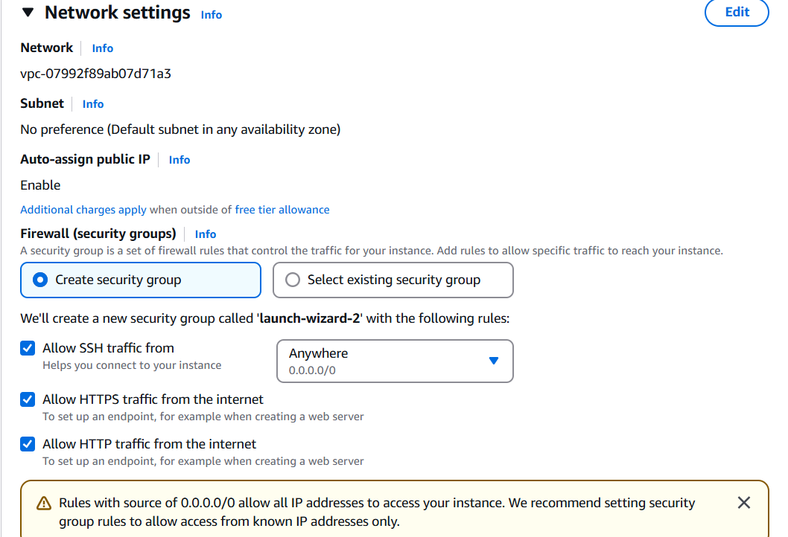
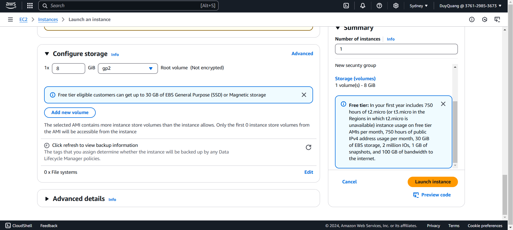
### B4: Thực hiện theo các bước sau:
* Sau khi tạo xong sẽ thấy instance đang ở trạng thái Running và nhấn vào Instance ID.

* Tìm đến ô Security và chọn Security groups.
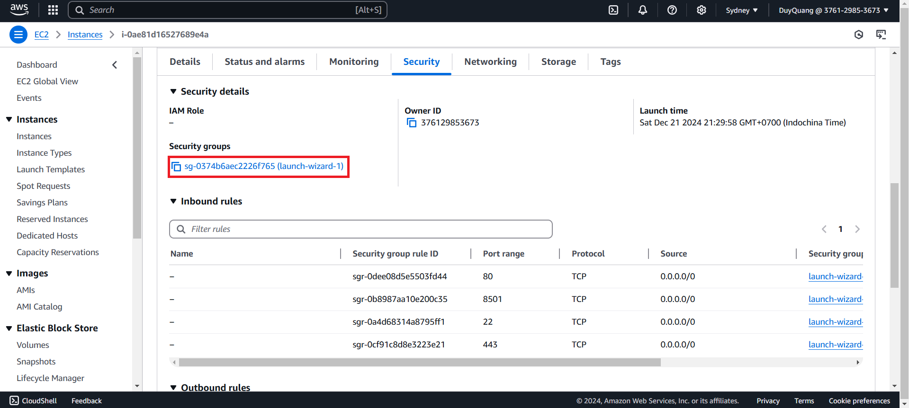
* Sau đó nhấn Edit inbound rules, tiếp theo nhấn Add rule chọn Type là Custom TCP, Port range là 8501 và chọn 0.0.0.0/0. Cuối cùng nhấn Save rules.

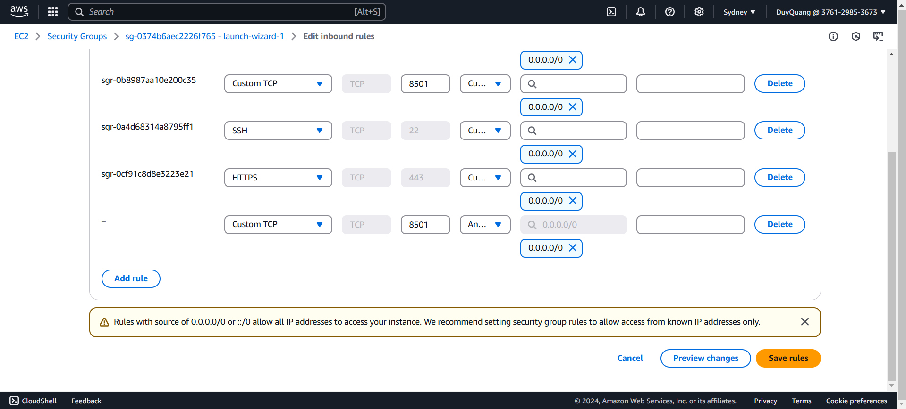
* Sau khi điều chỉnh các setting xong, trở về instance và nhấn chọn Connect để kết nối. Sau khi kết nối thành công sẽ hiện ra giao diện như bên dưới.
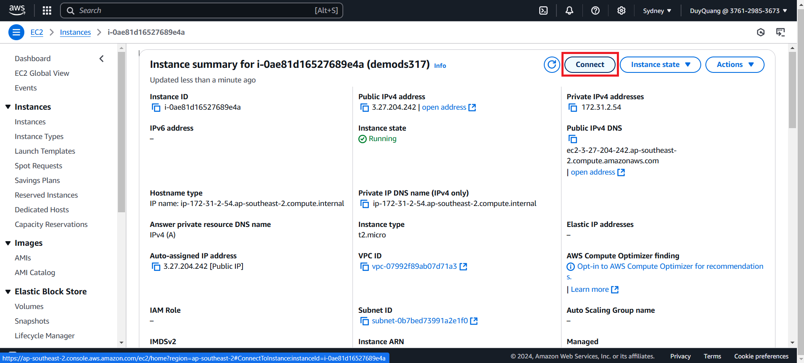

### B5: Lần lượt thực hiện các câu lệnh bên dưới:
```
sudo apt update
```
```
sudo apt-get update
```
```
sudo apt upgrade -y
```
```
sudo apt install git curl unzip tar make sudo vim wget -y
```
```
git clone "https://github.com/Wan1302/DS317-project.git"
```
```
cd DS317-project/web
```
```
sudo apt install python3-pip
```
```
sudo apt install python3.12-venv
```
```
# Tạo môi trường ảo
python3 -m venv venv
```
```
# Kích hoạt môi trường ảo
source venv/bin/activate
```
```
pip3 install -r requirements.txt
```
```
#Temporary running
python3 -m streamlit run app.py
```
### B6: Sau khi chạy xong các câu lệnh trên sẽ hiện ra External URL, copy URL này bỏ lên trình duyệt sẽ thấy được website.
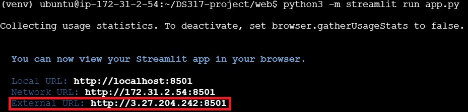
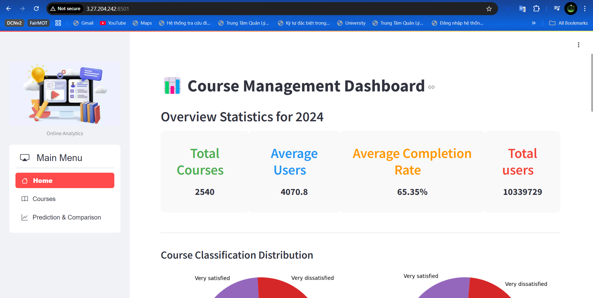

## III. Các bước triển khai trên `S3`:
### B1: Đăng nhập tài khoản trên AWS và tìm chọn service `S3`.
### B2: Nhấn chọn Create bucket
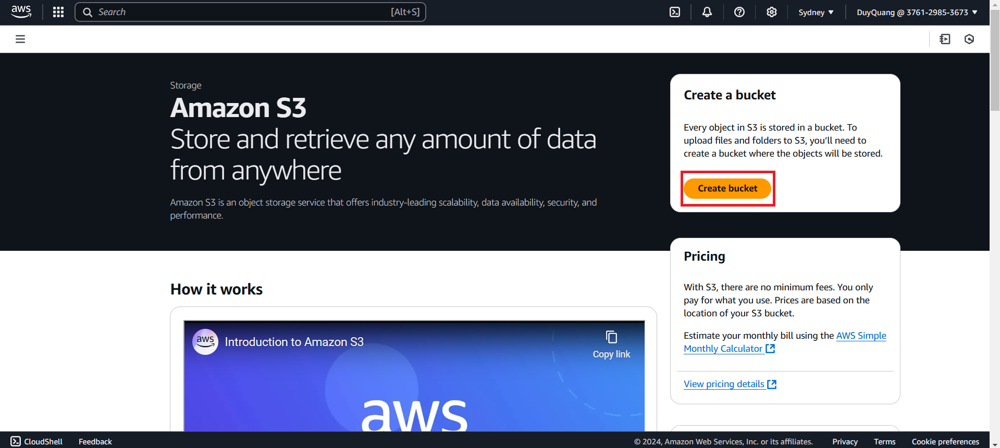
### B3: Thực hiện theo các bước sau:
* Chọn tên cho bucket (tên bucket phải là unique).
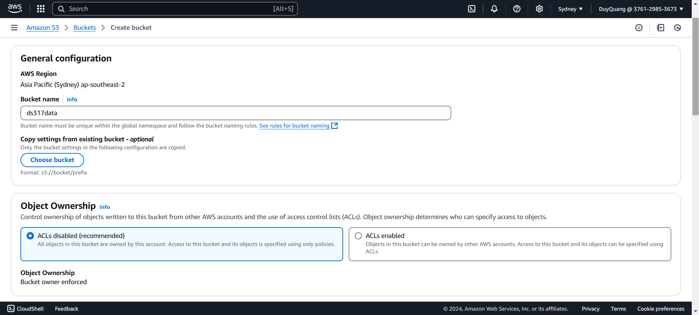
* Bỏ tích chọn Block all public access và ở phần Bucket Versioning chọn Disable.
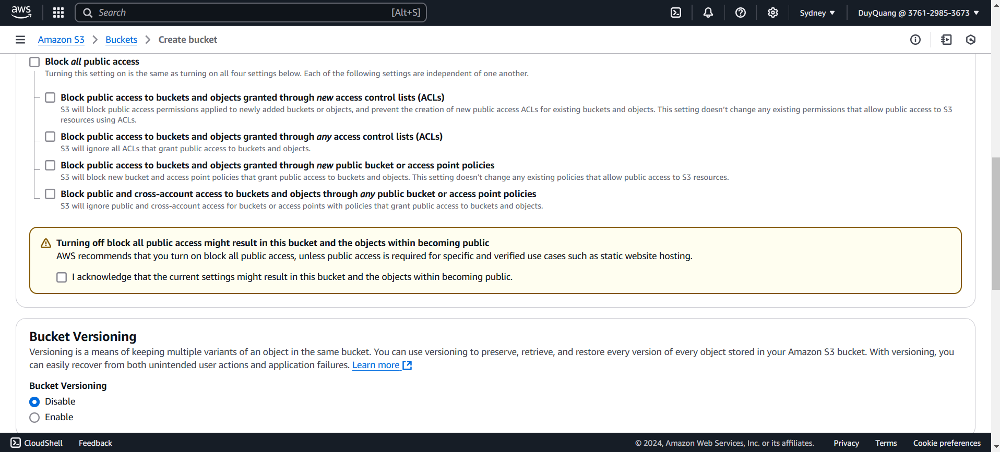
* Các setting khác giữ nguyên mặc định và nhấn Create bucket.
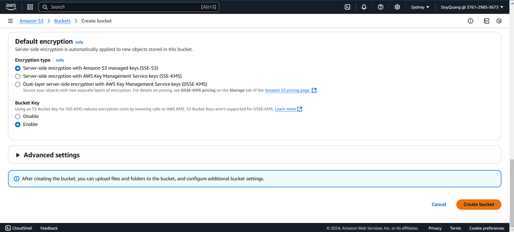
### B4: Thực hiện theo các bước sau:
* Sau khi tạo xong bucket, nhấn vào tên bucket vừa tạo.
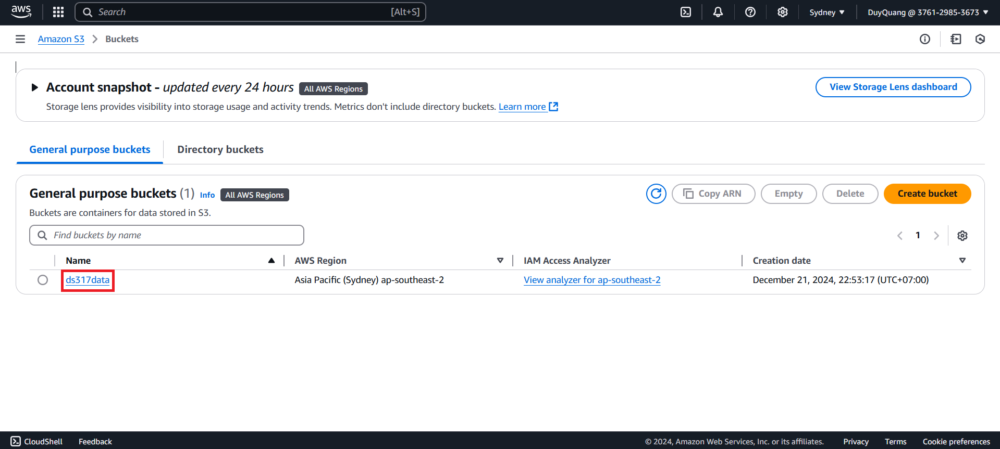
* Tiếp theo nhấn Add files hoặc Add folder để thêm files hoặc folder mong muốn.

* Nhấn upload và xong khi upload thành công sẽ được kết quả như bên dưới.

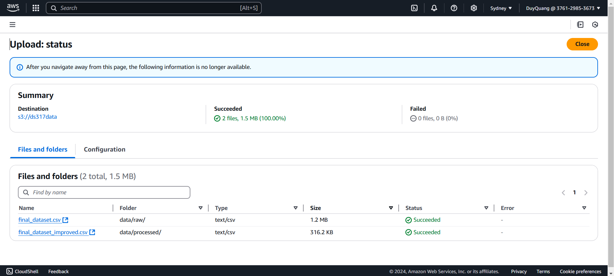