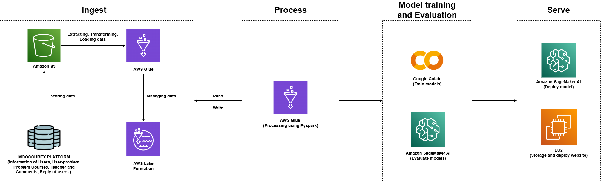

# 
Kịch bản demo chi tiết

## **Mục tiêu của demo**
- Giới thiệu các tính năng của ứng dụng web.
- Mô tả cách hệ thống hỗ trợ quản lý và phân tích dữ liệu khóa học.
- Minh họa khả năng dự đoán mức độ hài lòng và so sánh các khóa học.

---

## **Kịch bản demo chi tiết**: 
Giả sử dữ liệu của các khóa học được lấy từ nền tảng MOOCCUBEX và được xử lý theo pipeline sau:

Vì dữ liệu của nhóm thu thập là dữ liệu tĩnh nên sau khi xử lí sẽ chia làm hai file, một file tượng trưng cho các khóa học năm 2024 và một file tượng trưng cho các khóa học 2025. Dựa trên dữ liệu khóa học giả định vào năm 2024 và 2025, nhóm xây dựng một kịch bản như sau:

### **1. Mở đầu**
- **Mở ứng dụng web** và nhấn mạnh giao diện hiện đại, thân thiện với người dùng.
- Giới thiệu các **tính năng chính** trên menu bên trái:
  - Trang chủ (`Home`): Tổng quan dữ liệu.
  - Quản lý khóa học (`Courses`): Xem thông tin chi tiết của từng khóa học.
  - Dự đoán và so sánh (`Prediction & Comparison`): Dự đoán mức độ hài lòng và so sánh giữa hai năm.

---

### **2. Trình bày trang "Home"**
- **Hiển thị số liệu thống kê tổng quan**:
  - Tổng số khóa học.
  - Số lượng người dùng trung bình.
  - Tỷ lệ hoàn thành khóa học trung bình.
  - Tổng số người dùng.
- **Biểu đồ phân phối khóa học theo mức độ hài lòng**:
  - Pie chart cho năm 2024 và năm 2025.
  - Nhấn mạnh sự thay đổi (nếu có) giữa hai năm.
- **So sánh số liệu trung bình giữa hai năm**:
  - Dùng biểu đồ cột để minh họa sự khác biệt về số lượng người dùng, bình luận, tài nguyên và tỷ lệ hoàn thành.
- **Đánh giá chất lượng dữ liệu**:
  - Hiển thị bảng đánh giá mức độ đầy đủ, chính xác, nhất quán, và duy nhất của dữ liệu trước và sau cải thiện.

---

### **3. Trình bày trang "Courses"**
- **Chọn khóa học cụ thể từ danh sách**.
- **Hiển thị thông tin chi tiết về khóa học**:
  - Số lượng người dùng.
  - Số lượng tài nguyên.
  - Tổng số bình luận.
- **Phân tích cảm xúc từ bình luận**:
  - Pie chart phân phối cảm xúc (Tích cực, Tiêu cực, Trung lập).
  - Bar chart minh họa số lượng từng loại cảm xúc.
- **So sánh trực quan**:
  - Biểu đồ cột so sánh số lượng người dùng và tài nguyên của khóa học.

---

### **4. Trình bày trang "Prediction & Comparison"**
- **Dự đoán mức độ hài lòng**:
  - Chọn một khóa học từ đang diễn ra và chưa kết thúc (năm 2025).
  - Nhấn nút "Predict Satisfaction Level" để hiển thị mức độ hài lòng dự đoán.
- **So sánh với khóa học năm 2024**:
  - Chọn khóa học tương ứng đã kết thúc (năm 2024).
  - Hiển thị bảng so sánh thông tin chi tiết của hai khóa học.
  - Biểu đồ cột minh họa sự khác biệt về cảm xúc, số lượng bình luận, tài nguyên và người dùng giữa hai năm.

---